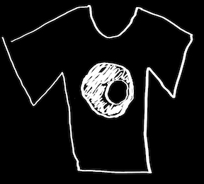

   
    

`tshirt` README
==========================================
The Time Series Helper & Integration Reduction Tool `tshirt` is a general-purpose tool for time series science.
Its main application is to process raw data on exoplanet systems.
`tshirt` can:

- Reduce raw data: flat field, bias subtract, gain correct, etc. This has been demonstrated to work with merged CCD images from Mont4K imager on the Kuiper-61 inch on Mt Bigelow, AZ.
- Extract Photometry
- Extract Spectroscopy

See the read-the-docs page for information on how to install and use `tshirt`:
[https://tshirt.readthedocs.io/en/latest/](https://tshirt.readthedocs.io/en/latest/)
